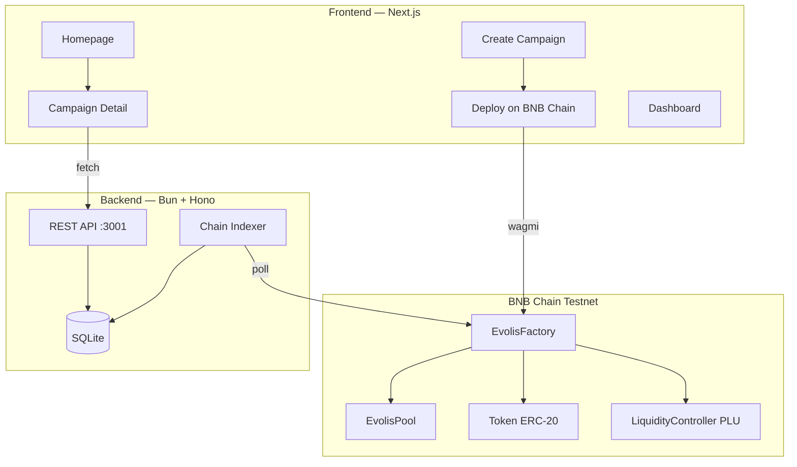
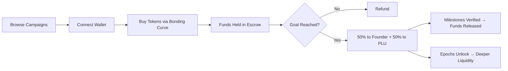

<p align="center">
  <h1 align="center">🧬 Evolis</h1>
  <p align="center"><strong>Milestone-Gated Tokenized Crowdfunding on BNB Chain</strong></p>
  <p align="center">
    <a href="https://github.com/ShauryaKesarwani/Evolis/blob/main/LICENSE"></a>
    <a href="https://testnet.bscscan.com/address/0x2c281243A1013A9Be20a7415ee6D0CdCd8Aae39b"></a>
    
    
  </p>
</p>

---

**Evolis** is a decentralized crowdfunding protocol where startups raise capital through token sales with **bonding curve pricing**, **milestone-gated fund release**, and **progressive liquidity unlock (PLU)** — all on BNB Chain.

Backers get token upside + refund protection. Founders get non-dilutive funding with milestone accountability.

---

## 🎯 The Problem

| Traditional Crowdfunding | Web3 Token Launches |
|--------------------------|---------------------|
| Funds released instantly — no accountability | No milestone gating — rug pulls are trivial |
| No liquidity — backers can't exit | All liquidity enters at once — high volatility |
| No upside if project succeeds | Whale manipulation distorts price discovery |

## 💡 The Solution

Evolis combines the best of both worlds:

1. **Bonding Curve Fundraise** — Fair, transparent token pricing with slippage protection
2. **Escrow Protection** — Funds locked until funding goal met; refunds if not
3. **Milestone Gating** — Capital released only after verified milestone completion
4. **Progressive Liquidity Unlock** — Token liquidity deepens over 30+ days, reducing volatility
5. **IL Protection** — Duration-based impermanent loss compensation for liquidity providers

---

## 🏗 Architecture



> 📖 Full architecture details: [docs/ARCHITECTURE.md](docs/ARCHITECTURE.md)

---

## 🚶 User Journey



> 📖 Detailed user journeys (supporter + founder): [docs/USER_JOURNEY.md](docs/USER_JOURNEY.md)

---

## 🚀 Quick Start

### Prerequisites
- Node.js 18+, Bun, Foundry (forge/cast/anvil), Git

### Setup
```bash
git clone https://github.com/ShauryaKesarwani/Evolis.git
cd Evolis

# Backend
cd backend && bun install
cp .env.example .env  # Configure RPC_URL, FACTORY_ADDRESS, ADMIN_PRIVATE_KEY
bun dev               # → http://localhost:3001

# Frontend (new terminal)
cd frontend && bun install
cp .env.example .env.local  # Configure NEXT_PUBLIC_API_URL, NEXT_PUBLIC_FACTORY_ADDRESS
bun dev                     # → http://localhost:3000
```

> 📖 Full setup guide with BNB Testnet deployment: [docs/SETUP.md](docs/SETUP.md)

---

## 📜 Smart Contracts

| Contract | Purpose |
|----------|---------|
| **EvolisFactory** | Deploy & register campaign pools |
| **EvolisPool** | Bonding curve + escrow + IL protection |
| **Token** | Standard ERC-20 with fixed supply |
| **LiquidityController** | Progressive Liquidity Unlock engine |

**Deployed on BNB Chain Testnet:**

| Contract | Address |
|----------|---------|
| EvolisFactory | [`0x2c281243...`](https://testnet.bscscan.com/address/0x2c281243A1013A9Be20a7415ee6D0CdCd8Aae39b) |
| EvolisPool | [`0xc956ccb7...`](https://testnet.bscscan.com/address/0xc956ccb7E961FDE8689f54895F6c67e4E44C05F8) |
| Token | [`0x47626109...`](https://testnet.bscscan.com/address/0x4762610940Ad0aA5Aa7c6911E8EE690f8BDc2ed7) |
| Controller | [`0x3DCB4399...`](https://testnet.bscscan.com/address/0x3DCB43994B3e03b40F8FFba12a9950D1c968d761) |

**Test Suite:** 26/27 passing (96.3%)

> 📖 Contract reference, test results, parameters: [docs/CONTRACTS.md](docs/CONTRACTS.md)

---

## 🖥 Frontend

Built with **Next.js 14**, **Tailwind CSS**, and **Wagmi** for wallet connectivity.

| Page | Description |
|------|-------------|
| **Home** | Hero, How It Works, Campaign Grid with filters |
| **Create Campaign** | 5-step wizard → deploy on BNB Chain |
| **Campaign Detail** | Funding progress, token purchase, milestones, activity feed |
| **Dashboard** | My investments & campaigns |
| **Admin** | Milestone verification (admin-gated) |

> 📖 Component tree, design system, API integration: [docs/FRONTEND.md](docs/FRONTEND.md)

---

## 🔌 Backend

Built with **Bun**, **Hono**, and **SQLite**. Indexes on-chain data and serves it to the frontend.

| Endpoint | Description |
|----------|-------------|
| `GET /projects` | List all campaigns |
| `GET /project/:id` | Campaign details (auto-fetches from chain) |
| `POST /projects` | Save campaign metadata |
| `GET /project/:id/milestones` | List milestones |
| `POST /verify-milestone` | Admin: verify milestone |

> 📖 Full API reference, DB schema, indexer details: [docs/BACKEND.md](docs/BACKEND.md)

---

## 💰 Token & Business Model

```
Total Supply: Configurable per campaign

Distribution:
├── 40% — Bonding Curve Sale
└── 60% — Locked for Progressive Liquidity Unlock

Purchase Fees:
├── 1.0% — Platform fee
└── 0.5% — IL Protection fund

Escrow Flow:
Goal Reached → 50% to founder + 50% to progressive liquidity
             → Remaining funds released per verified milestone
```

> 📖 Full vision, GTM strategy, roadmap: [docs/VISION.md](docs/VISION.md)

---

## 🗺 Roadmap

| Status | Feature |
|--------|---------|
| ✅ | Smart contracts (EvolisFactory + Pool + Token + Controller) |
| ✅ | Bonding curve fundraise with escrow |
| ✅ | Progressive Liquidity Unlock (PLU) engine |
| ✅ | IL protection + circuit breaker |
| ✅ | Next.js frontend (6 pages, 27+ components) |
| ✅ | Wallet integration (Wagmi + WalletConnect) |
| ✅ | Backend API + chain indexer |
| ✅ | BNB Chain Testnet deployment |
| ⏳ | **Anti-whale dynamic fees** (Code ready, needs integration) |
| ⏳ | **Status Filters & Sorting** (Frontend UI polish) |
| 🔮 | **Chainlink Automation** (Automated epoch triggering) |
| 🔮 | **Governance / DAO** (On-chain protocol decisions) |
| 🔮 | **Post-launch incentive programs** (Farming, staking, rewards) |
| 🔮 | **AI-themed token templates** (Specialized mechanics) |
| 🔮 | **Multi-chain expansion** (Ethereum, Polygon, Arbitrum) |
| 🔮 | **Formal security audit** |
| 🔮 | **BNB Chain Mainnet deployment** |

> 📖 Full unimplemented feature list: [docs/UNIMPLEMENTED.md](docs/UNIMPLEMENTED.md)

---

## 📚 Documentation

| Document | Contents |
|----------|----------|
| [ARCHITECTURE.md](docs/ARCHITECTURE.md) | System diagrams, DB schema, API reference |
| [USER_JOURNEY.md](docs/USER_JOURNEY.md) | Supporter & founder flow diagrams |
| [SETUP.md](docs/SETUP.md) | Installation, configuration, deployment |
| [CONTRACTS.md](docs/CONTRACTS.md) | Smart contract reference & test results |
| [FRONTEND.md](docs/FRONTEND.md) | Pages, components, design system |
| [BACKEND.md](docs/BACKEND.md) | API endpoints, indexer, database |
| [VISION.md](docs/VISION.md) | Problem, solution, business model, roadmap |
| [UNIMPLEMENTED.md](docs/UNIMPLEMENTED.md) | Planned features not yet built |

---

## 🔐 Security

- All funds held in on-chain smart contracts — backend never custodies funds
- ReentrancyGuard on EvolisPool
- Circuit breaker for extreme price movements
- Epoch timing enforcement prevents premature unlocks
- Admin routes gated by wallet address verification
- Environment variables for all secrets (never hardcoded)
- `.gitignore` covers `.env`, `.env.*`, `*.key`, `*.pem`, `*.secret`, private keys

> ⚠️ **Not yet audited.** Formal security audit planned before mainnet deployment.

---

## 🤝 Contributing

1. Fork the repository
2. Create a feature branch (`git checkout -b feature/amazing-feature`)
3. Commit changes (`git commit -m 'Add amazing feature'`)
4. Push to branch (`git push origin feature/amazing-feature`)
5. Open a Pull Request

---

## 📄 License

This project is licensed under the **MIT License** — see [LICENSE](LICENSE) for details.

---

<p align="center">
  <strong>Built for BNB Chain 🟡</strong>
</p>
