<p align="center">
  <h1 align="center">🧬 Evolis</h1>
  <p align="center"><strong>Milestone-Gated Tokenized Crowdfunding on BNB Chain</strong></p>
  <p align="center">
    <a href="https://github.com/ShauryaKesarwani/Evolis/blob/main/LICENSE"></a>
    <a href="https://testnet.bscscan.com/address/0x2c281243A1013A9Be20a7415ee6D0CdCd8Aae39b"></a>
    
    
  </p>
</p>

---

Evolis is a decentralized crowdfunding protocol where startups raise capital through token sales with **bonding curve pricing**, **milestone-gated fund release**, and **progressive liquidity unlock (PLU)** — all natively built on **BNB Chain**.

> [!NOTE]
> **First-of-its-kind on BNB Chain:** Evolis pioneers a novel approach combining Bonding Curves + Milestone Escrow + Progressive Liquidity Unlock + IL Protection. This technical innovation brings fresh ideas to Web3 fundraising.

## 🎯 Value Proposition

Backers get token upside with strict refund protection if goals aren't met or founders fail to deliver. Founders get non-dilutive, predictable funding with milestone accountability, removing the need for VC middlemen. 

## ⚖️ Problem → Solution

| Traditional & Web3 Crowdfunding (The Problem) | Evolis Protocol (The Solution) |
|-----------------------------------------------|--------------------------------|
| Funds released instantly — no accountability or rug pulls are trivial | **Escrow & Milestone Gating** — Capital released only after verified milestone completion. |
| No liquidity — backers can't exit, or all enters at once | **Progressive Liquidity Unlock (PLU)** — Token liquidity deepens over 30+ days, reducing volatility. |
| Whale manipulation distorts price discovery | **Bonding Curve Fundraise** — Fair, predictable token pricing with built-in slippage protection. |
| Liquidity providers suffer impermanent loss | **IL Protection** — Duration-based compensation for liquidity providers to ensure sustainability. |

## 👥 Target Users

1. **Founders & Builders:** Seeking transparent, community-driven funding without diluting equity, requiring clear step-by-step capital unlocks.
2. **Web3 Supporters & Investors:** Looking to back early-stage projects with minimized risk, guaranteed refunds on failure, and verifiable on-chain accountability.

## 🚶 User Journey (Design & Usability)

Evolis is built for users, functioning intuitively to abstract away the complexity of smart-contract operations.

```mermaid
graph TD
    %% Nodes
    Founder[🚀 Founder<br/>Creates Campaign]
    Backer[💰 Backer<br/>Funds Project]
    Platform[🖥️ Evolis Platform]
    Escrow[🔒 Escrow<br/>Locked on BNB Chain]
    Voting[🗳️ Community Vote<br/>Token Holders Decide]
    Locked[🔐 Funds Stay Locked<br/>Backers Protected]

    %% Interactions
    Founder -->|1. Creates Campaign| Platform
    Backer -->|2. Funds Project| Platform

    Platform -->|Locks Funds| Escrow
    Platform -->|Opens Vote| Voting

    Founder -->|3. Submits Proof| Voting
    Voting -->|4. Approved ✅| Escrow
    Escrow -->|5. Releases Funds| Founder

    Voting -->|4. Rejected ❌| Locked

    %% Styling
    classDef person fill:#FFE66D,stroke:#111,stroke-width:3px,color:#111
    classDef platformStyle fill:#FCFAF6,stroke:#111,stroke-width:3px,color:#111
    classDef chain fill:#F7931A,stroke:#111,stroke-width:3px,color:#111
    classDef safe fill:#68A063,stroke:#111,stroke-width:3px,color:#fff

    class Founder,Backer person
    class Platform platformStyle
    class Escrow,Voting chain
    class Locked safe
```


<summary>View User Journey Mermaid Diagram Source</summary>




## 🏗 System Architecture (Technical Implementation & Code Quality)

We build for users, not just judges. Below is our complete, transparent, and labeled architecture breakdown showing modules, data flow, and tech stack.

```mermaid
graph TD
    classDef user fill:#FFE66D,stroke:#111,stroke-width:2px,color:#111
    classDef frontend fill:#1a1a1a,stroke:#444,stroke-width:2px,color:#fff
    classDef backend fill:#f3e8ff,stroke:#9333ea,stroke-width:2px,color:#111
    classDef contract fill:#fef08a,stroke:#ca8a04,stroke-width:2px,color:#111
    classDef storage fill:#dcfce7,stroke:#16a34a,stroke-width:2px,color:#111

    Founder("🚀 Founder"):::user
    Backer("💰 Backer"):::user

    subgraph FE["🖥️ Frontend"]
        UI["Next.js + Tailwind"]:::frontend
        Hooks["Wagmi + Viem"]:::frontend
        UI <--> Hooks
    end

    subgraph BE["🖧 Backend"]
        API["Bun + Hono REST API"]:::backend
        Indexer["Chain Event Indexer"]:::backend
        DB[("MongoDB")]:::storage
        API --> DB
        Indexer --> DB
    end

    subgraph SC["⛓️ BNB Chain"]
        Factory["EvolisFactory.sol"]:::contract
        Pool["EvolisPool.sol<br/>Escrow + Bonding Curve"]:::contract
        Voting["VotingModule.sol"]:::contract
        PLU["LiquidityController.sol"]:::contract

        Factory -->|Deploys| Pool
        Voting -->|Triggers| PLU
    end

    Founder & Backer -->|Interact| UI
    Hooks -->|Transactions| Factory
    Hooks -->|Buy / Vote| Pool & Voting
    UI <-->|REST Calls| API
    Factory & Voting & PLU -.->|Events| Indexer
```

<summary>View System Architecture Mermaid Diagram Source</summary>




> [!IMPORTANT]
> **Clean Technical Implementation:** Our Next.js interface communicates with a fast, lightweight Bun+Hono component for sub-second UI index tracking, while all fundamental rules live verifiably on-chain via the `EvolisPool` and `LiquidityController`.

## � BNB Chain Integration & Ecosystem Fit

Evolis is purposefully connected to strengthen the BNB Chain ecosystem by providing safe, scalable crowdfunding infrastructure. We utilize BNB Chain's unmatched throughput to execute deep logic securely at scale.

**Verified Smart Contracts (BNB Testnet):**
- **EvolisFactory:** [`0x2c281243A1013A9Be20a7415ee6D0CdCd8Aae39b`](https://testnet.bscscan.com/address/0x2c281243A1013A9Be20a7415ee6D0CdCd8Aae39b)
- **EvolisPool:** [`0xc956ccb7E961FDE8689f54895F6c67e4E44C05F8`](https://testnet.bscscan.com/address/0xc956ccb7E961FDE8689f54895F6c67e4E44C05F8)
- **Token:** [`0x4762610940Ad0aA5Aa7c6911E8EE690f8BDc2ed7`](https://testnet.bscscan.com/address/0x4762610940Ad0aA5Aa7c6911E8EE690f8BDc2ed7)
- **Controller:** [`0x3DCB43994B3e03b40F8FFba12a9950D1c968d761`](https://testnet.bscscan.com/address/0x3DCB43994B3e03b40F8FFba12a9950D1c968d761)

## 💰 Business / Token Model

Each campaign defines its own ERC-20 supply natively registered on BNB Chain:
- **Token Distribution:** 40% sold directly via Bonding Curve, 60% secured for Progressive Liquidity Unlock.
- **Protocol Fees:** 1.0% operational protocol fee + 0.5% pooled IL Protection fund.
- **Capital Flow:** Upon success, 50% deployed to founder / 50% to seed liquidity. Remaining funds are disbursed epoch-by-epoch exclusively as milestones clear.

## � Go-To-Market (GTM) Strategy

Evolis intends to capture momentum on BNB Chain with three vectors:
1. **Hackathon Pipeline:** Partnering with BNB Chain hackathons to be the default launchpad for incubated teams.
2. **Community Rewards:** Incentivizing early liquidity providers via protocol fee-sharing loops.
3. **B2B Architecture Deployment:** Offering `EvolisFactory` as a white-label protocol SDK for decentralized collectives and DAOs to fund sub-projects natively.

## ⚙️ Setup + Run Instructions

Deploying the Evolis platform is heavily streamlined for developers.

> [!TIP]
> **Prerequisites:** `Node.js 18+`, `Bun`, `Foundry` (forge/cast/anvil), and `Git`.

```bash
# Clone the protocol repository
git clone https://github.com/ShauryaKesarwani/Evolis.git
cd Evolis

# 1. Start the Backend API + Chain Indexer
cd backend
bun install
cp .env.example .env  # Update RPC_URL and FACTORY_ADDRESS
bun dev               # Server runs on http://localhost:3001

# 2. Start the Provider Frontend (Next.js)
cd ../frontend
bun install
cp .env.example .env.local  # Set NEXT_PUBLIC_API_URL & NEXT_PUBLIC_FACTORY_ADDRESS
bun dev                     # App serving on http://localhost:3000
```

## � Roadmap (Sustainability & Market Potential)

Evolis represents a highly sustainable foundation designed well beyond the current hackathon:

### Phase 1: Hackathon MVP (Accomplished ✅)
- On-chain foundation: Bonding curve issuance, IL protection, Escrow and PLU engine.
- Complete full-stack MVP implementation on BNB Testnet (`Next.js` / `Bun`).

### Phase 2: Protocol Maturation (Upcoming) ⏳
- **Chainlink Automation:** Fully automated epoch triggering eliminating all centralized admin requirements.
- **Advanced Dynamic Mechanics:** Implementing anti-whale transaction fees during high velocity funding windows.
- **Comprehensive Smart Contract Security Audit.**

### Phase 3: Mainnet Transition & Custom Tokenomics 🔮
- **BNB Chain Mainnet Launch:** Moving to high-liquidity production environments.
- **Evolis DAO Governance:** Community governed parameter and fee structure adjustments.
- **AI-Themed Token Templates:** Deploying distinct smart curve configurations for specialized economic behaviors.

---
<p align="center">
  <strong>Innovation meets Accountability. Built for BNB Chain 🟡</strong>
</p>
