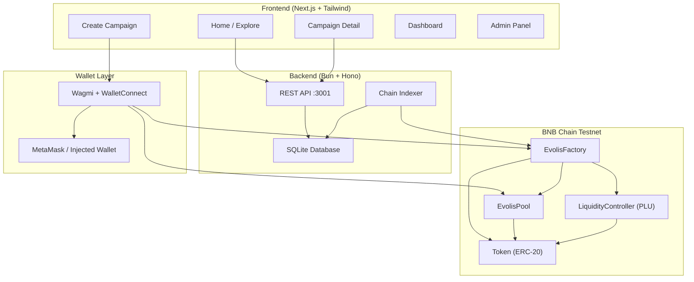
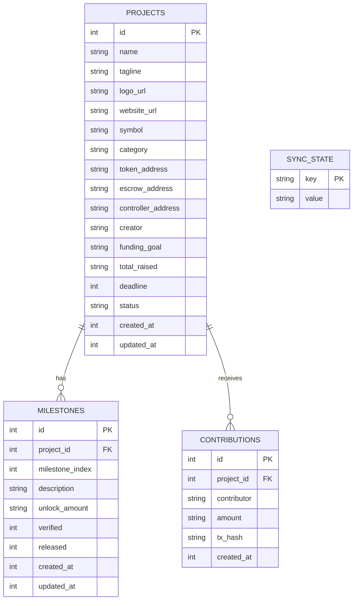

# Evolis — System Architecture

## High-Level Overview

Evolis is a **milestone-gated tokenized crowdfunding platform** on BNB Chain. The system has three main layers: a Next.js frontend, a Bun/Hono backend, and Solidity smart contracts deployed on BNB Chain Testnet.



---

## Smart Contract Layer

### EvolisFactory
**Purpose:** Deploy and register new project pools.

- `createPool(params)` → atomically deploys Token + EvolisPool + LiquidityController
- Tracks all deployed pools via `poolCount()` and `getPool(index)`
- Emits deployment events for indexing

### EvolisPool
**Purpose:** The core contract combining bonding curve fundraise, milestone escrow, and IL protection. Each campaign gets its own EvolisPool instance.

**Phase 1 — Bonding Curve Fundraise:**
- Users buy project tokens at a configurable price (`buyBondingCurve()`)
- 1% platform fee + 0.5% IL protection fund deducted per purchase
- Funds held in escrow until funding goal is reached
- If goal not met by deadline → refunds enabled

**Phase 2 — Milestone Escrow:**
- On funding goal reached: 50% BNB released to project owner, 50% reserved for progressive liquidity
- Milestone verification via admin/backend
- Progressive fund release gated by milestone completion

**Phase 3 — Post-Funding:**
- EvoLP tokens minted to backers (proportional to BNB contribution)
- IL protection: coverage scales with holding duration (0% < 30d, 50% 30-90d, 100% > 90d)
- Circuit breaker for extreme price movements

### Token (ERC-20)
Standard ERC-20 with fixed supply, minted at deployment to the pool and controller.

### LiquidityController (PLU)
**Progressive Liquidity Unlock engine:**
- Holds locked tokens (e.g., 60% of supply)
- Releases tokens epoch-by-epoch into AMM
- Configurable: unlock duration, epoch duration, total epochs
- `unlockEpoch()` — releases one epoch's worth of tokens
- `getUnlockProgress()` — returns current unlock status

### PLUPair + PLUFactory (Anti-Whale — Not Yet Integrated)
Custom AMM pair with dynamic whale fees. Code exists but is not wired into the production deployment path.

---

## Backend Layer

### Stack
| Component | Technology |
|-----------|-----------|
| Runtime | Bun |
| Framework | Hono |
| Database | Bun SQLite |
| Chain Client | Ethers.js v6 |

### REST API Endpoints

| Method | Path | Description |
|--------|------|-------------|
| `GET` | `/projects` | List all indexed projects |
| `POST` | `/projects` | Save campaign metadata after deployment |
| `GET` | `/project/:id` | Get project details (auto-fetches from chain if missing) |
| `GET` | `/project/:id/milestones` | List milestones for a project |
| `GET` | `/project/:id/contributors` | List contributors with aggregated amounts |
| `POST` | `/project/:id/contribute` | Record a contribution |
| `POST` | `/verify-milestone` | Admin: verify a milestone (requires `x-admin-address` header) |
| `POST` | `/release-milestone` | Admin: release milestone funds (requires `x-admin-address` header) |

### Chain Indexer
Polls `EvolisFactory.poolCount()` every 10 seconds. For each new pool discovered, fetches on-chain data (`projectToken`, `projectOwner`, `fundingGoal`, `deadline`, `totalRaised`, `goalReached`) and upserts into SQLite.

### Database Schema



---

## Frontend Layer

### Stack
| Component | Technology |
|-----------|-----------|
| Framework | Next.js 14 (App Router) |
| Styling | Tailwind CSS |
| Wallet | Wagmi + WalletConnect |
| State | React hooks + TanStack Query |
| Fonts | Martian Mono (headings) + Inter (body) |

### Pages
| Route | Page | Description |
|-------|------|-------------|
| `/` | Home | Hero, How It Works, Campaign Grid with filters |
| `/create` | Create Campaign | 5-step wizard (Project Info → Token Config → Funding Goal → Milestones → Review & Deploy) |
| `/campaign/[id]` | Campaign Detail | Funding progress, token purchase, milestone tracker, activity feed, founder actions |
| `/dashboard` | User Dashboard | My investments, my campaigns |
| `/deployments` | Deployments | List of token deployments |
| `/admin` | Admin Panel | Milestone verification (admin-gated) |

### Component Architecture
```
├── Navbar.tsx, Footer.tsx, ShrinkingFooter.tsx
├── ConnectWalletModal.tsx
├── home/
│   ├── HeroSection.tsx, HowItWorksSection.tsx
│   ├── CampaignCard.tsx, CampaignGrid.tsx, CampaignFilters.tsx
│   └── EscrowSphere.tsx
├── create-campaign/
│   ├── StepIndicator.tsx
│   ├── StepProjectInfo.tsx, StepTokenConfig.tsx
│   ├── StepFundingGoal.tsx, StepMilestones.tsx
│   └── StepReviewDeploy.tsx
├── campaign/
│   ├── CampaignHeader.tsx, FundingProgress.tsx
│   ├── TokenInfoPanel.tsx, TokenPurchasePanel.tsx
│   ├── MilestoneTracker.tsx, ActivityFeed.tsx
│   ├── ProjectDescription.tsx, FounderActionStrip.tsx
│   └── CampaignDetailLayout.tsx
└── plu/ (PLU-related components)
```

---

## Deployed Addresses (BNB Chain Testnet)

| Contract | Address |
|----------|---------|
| EvolisFactory | `0x2c281243A1013A9Be20a7415ee6D0CdCd8Aae39b` |
| Token | `0x4762610940Ad0aA5Aa7c6911E8EE690f8BDc2ed7` |
| EvolisPool | `0xc956ccb7E961FDE8689f54895F6c67e4E44C05F8` |
| LiquidityController | `0x3DCB43994B3e03b40F8FFba12a9950D1c968d761` |

**Explorer:** [BscScan Testnet](https://testnet.bscscan.com/address/0x2c281243A1013A9Be20a7415ee6D0CdCd8Aae39b)
