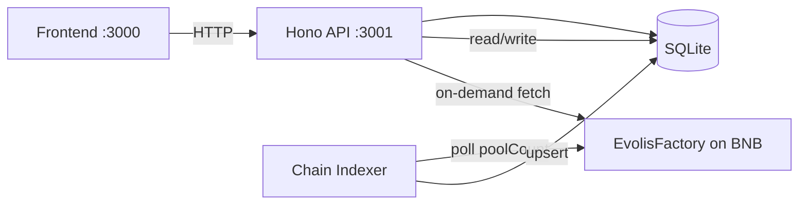

# Evolis — Backend

## Stack

| Component | Technology |
|-----------|-----------|
| Runtime | **Bun** |
| Framework | **Hono** (lightweight, fast) |
| Database | **Bun SQLite** (file-based) |
| Chain Client | **Ethers.js v6** |
| Port | `3001` (default) |

---

## Architecture



The backend serves two roles:
1. **REST API** — serves project, milestone, and contributor data to the frontend
2. **Chain Indexer** — polls the EvolisFactory contract on BNB Chain Testnet, discovers new pools, and indexes them into SQLite

---

## Configuration

**Environment variables** (`backend/.env`):

| Variable | Description | Example |
|----------|-------------|---------|
| `DATABASE_URL` | SQLite file path | `file:./data/dev.sqlite` |
| `RPC_URL` | BNB Chain RPC endpoint | `https://data-seed-prebsc-1-s1.binance.org:8545/` |
| `FACTORY_ADDRESS` | Deployed EvolisFactory address | `0x2c281243...` |
| `ADMIN_PRIVATE_KEY` | Admin wallet private key (for milestone verification) | `0x...` |
| `PORT` | API server port | `3001` |
| `ENABLE_INDEXER` | Enable/disable chain indexer | `true` |
| `CORS_ORIGIN` | Allowed CORS origin | `http://localhost:3000` |

---

## API Endpoints

### Projects

| Method | Path | Description |
|--------|------|-------------|
| `GET` | `/projects` | List all indexed projects |
| `POST` | `/projects` | Create/update project with frontend metadata (name, tagline, logo, etc.) |
| `GET` | `/project/:id` | Get single project. Auto-fetches from chain if not in DB. |

### Milestones & Contributors

| Method | Path | Description |
|--------|------|-------------|
| `GET` | `/project/:id/milestones` | List milestones for a project |
| `GET` | `/project/:id/contributors` | List contributors with aggregated amounts |
| `POST` | `/project/:id/contribute` | Record a contribution (contributor address, amount in wei, optional txHash) |

### Admin Routes

| Method | Path | Auth | Description |
|--------|------|------|-------------|
| `POST` | `/verify-milestone` | `x-admin-address` header | Verify a milestone |
| `POST` | `/release-milestone` | `x-admin-address` header | Release milestone funds |

Admin routes require the `x-admin-address` HTTP header to match the address derived from `ADMIN_PRIVATE_KEY`.

---

## Chain Indexer

The indexer runs in a continuous polling loop:

1. Calls `EvolisFactory.poolCount()` every 10 seconds
2. For each pool index not yet in DB, calls `fetchProjectFromChain(index)`
3. `fetchProjectFromChain` queries the pool contract for:
   - `projectToken()`, `projectOwner()`, `controller()`
   - `fundingGoal()`, `deadline()`, `totalRaised()`, `goalReached()`
4. Upserts the project record into SQLite
5. Gracefully handles RPC errors with exponential backoff logging

---

## Database Schema

### Projects Table
| Column | Type | Description |
|--------|------|-------------|
| `id` | INTEGER PK | Pool index from factory |
| `name` | TEXT | Campaign name (from frontend) |
| `tagline` | TEXT | Short description |
| `logo_url` | TEXT | Logo image URL |
| `website_url` | TEXT | Project website |
| `symbol` | TEXT | Token symbol |
| `category` | TEXT | Campaign category |
| `token_address` | TEXT | Deployed token address |
| `escrow_address` | TEXT | EvolisPool address |
| `controller_address` | TEXT | LiquidityController address |
| `creator` | TEXT | Project owner wallet |
| `funding_goal` | TEXT | Target BNB (wei string) |
| `total_raised` | TEXT | BNB raised so far (wei string) |
| `deadline` | INTEGER | Unix timestamp |
| `status` | TEXT | ACTIVE / FUNDED |
| `created_at` | INTEGER | Unix timestamp |
| `updated_at` | INTEGER | Unix timestamp |

### Milestones Table
| Column | Type | Description |
|--------|------|-------------|
| `id` | INTEGER PK | Auto-increment |
| `project_id` | INTEGER FK | References projects(id) |
| `milestone_index` | INTEGER | Order within project |
| `description` | TEXT | Milestone description |
| `unlock_amount` | TEXT | BNB to unlock (wei string) |
| `verified` | INTEGER | 0 or 1 |
| `released` | INTEGER | 0 or 1 |

### Contributions Table
| Column | Type | Description |
|--------|------|-------------|
| `id` | INTEGER PK | Auto-increment |
| `project_id` | INTEGER FK | References projects(id) |
| `contributor` | TEXT | Wallet address |
| `amount` | TEXT | BNB contributed (wei string) |
| `tx_hash` | TEXT | Transaction hash (optional) |

### Sync State Table
| Column | Type | Description |
|--------|------|-------------|
| `key` | TEXT PK | State key |
| `value` | TEXT | State value |

---

## Running

```bash
cd backend
bun install
bun dev
```

The server starts at `http://localhost:3001` with CORS enabled for the frontend origin.
