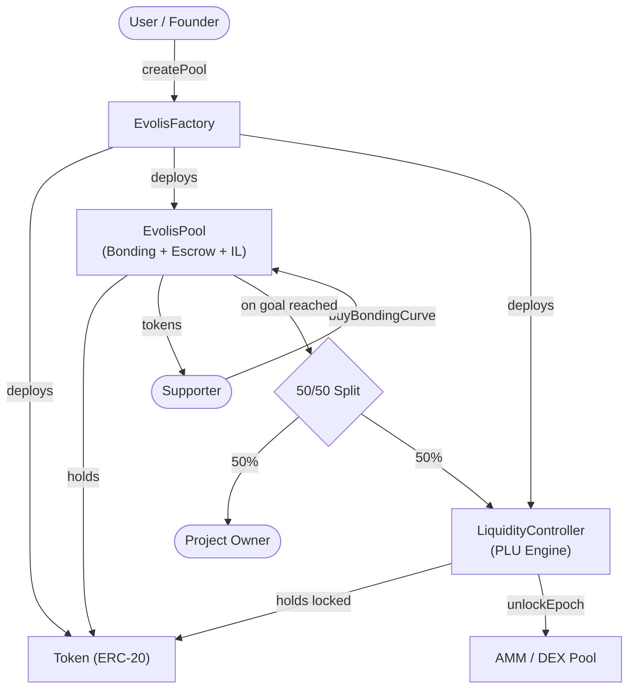

# Evolis — Smart Contracts

## Overview

Evolis uses a factory-based architecture where each campaign deploys a self-contained set of contracts. All contracts are written in Solidity 0.8.20 and use OpenZeppelin libraries.

**Network:** BNB Chain Testnet (Chain ID: 97)  
**Framework:** Foundry (forge, cast, anvil)

---

## Contract Architecture



---

## Contracts Reference

### 1. EvolisFactory

**Purpose:** Deploy and register new campaign pools.

| Function | Description |
|----------|-------------|
| `createPool(params)` | Atomically deploy Token + EvolisPool + LiquidityController |
| `poolCount()` | Total number of deployed pools |
| `getPool(index)` | Get pool address by index |

---

### 2. EvolisPool

**Purpose:** The monolithic campaign contract handling bonding curve sale, escrow, milestones, and IL protection.

**Storage:**
- `projectToken` — address of the campaign's ERC-20 token
- `projectOwner` — campaign creator's address
- `controller` — linked LiquidityController
- `fundingGoal` — BNB target
- `deadline` — fundraise deadline timestamp
- `milestoneDeadline` — milestone completion deadline
- `totalRaised` — cumulative BNB raised
- `bondingActive` — phase flag
- `goalReached` — funding goal flag
- `contributions[address]` — per-backer BNB tracking
- `ilFund` — IL protection pool

**Key Functions:**

| Function | Description |
|----------|-------------|
| `buyBondingCurve(minTokensOut)` | Buy tokens during funding phase. Deducts 1% platform fee + 0.5% IL fund. |
| `setController(controller)` | Link the LiquidityController (factory-only) |
| `refund()` | Claim BNB refund if deadline passed without reaching goal |

**Events:**
- `TokensPurchased(buyer, bnbAmount, tokensReceived)`
- `GoalReached(totalRaised)`
- `Refunded(user, amount)`
- `EvoLPClaimed(backer, amount, entryPrice)`
- `ILCompensationClaimed(lp, amount)`
- `CircuitBreakerTripped(priceChangeBps, resumeAt)`

**IL Protection:**
- 0.5% of every purchase funds the IL pool
- Coverage: < 30 days = 0%, 30–90 days = 50%, > 90 days = 100%
- Based on price drop from entry price at time of EvoLP claim

**Circuit Breaker:**
- Pauses trading during extreme price movements
- Auto-resumes after cooldown period

---

### 3. Token (ERC-20)

Standard OpenZeppelin ERC-20 with fixed supply minted at deployment.

```solidity
constructor(string name, string symbol, uint256 totalSupply, address recipient)
```

---

### 4. LiquidityController (PLU Engine)

**Progressive Liquidity Unlock** — holds locked tokens and releases them into AMM over time.

**Configuration (set at deployment):**
- `unlockDuration` — total unlock period (e.g., 180 days)
- `epochDuration` — time between unlocks (e.g., 30 days)
- `totalEpochs` — computed as `unlockDuration / epochDuration`
- `unlockPerEpoch` — tokens released per epoch

**Key Functions:**

| Function | Description |
|----------|-------------|
| `initialize(initialTokenAmount)` | Add initial liquidity to DEX (payable) |
| `unlockEpoch()` | Release one epoch of tokens + BNB into AMM (payable) |
| `manualAddLiquidity(tokenAmount)` | Owner manual liquidity injection (payable) |
| `getUnlockProgress()` | Returns `(epochsUnlocked, totalEpochs, tokensUnlocked, tokensRemaining)` |
| `getTimeUntilNextEpoch()` | Seconds until next epoch unlock |
| `getUnlockableEpochs()` | Number of epochs available to unlock |

**Events:**
- `LiquidityUnlocked(epoch, tokenAmount, bnbAmount, liquidity)`

---

### 5. PLUPair + PLUFactory (Anti-Whale — Code Ready, Not Integrated)

Custom AMM pair with dynamic whale fees. **Code exists in `contracts/src/` but is not wired into the production deployment path.**

**Dynamic Fee Tiers:**

| Trade Size (% of reserves) | Fee |
|---------------------------|-----|
| < 1% | 0.25% (base) |
| 1% – 2.5% | 0.50% |
| 2.5% – 5% | 1.00% |
| 5% – 10% | 1.5% – 3% (progressive) |
| > 10% | 5.00% (max) |

**Epoch-based discount:** Fees decrease as pool matures (0% discount on day 1 → 50% discount after day 30).

---

## Test Suite

| Suite | Tests | Status |
|-------|-------|--------|
| TokenFactory | 12/12 | ✅ Passing |
| Integration | 3/3 | ✅ Passing |
| LiquidityController V3 | 11/12 | ⚠️ 1 failing (V3 epoch count edge case) |
| **Total** | **26/27** | **96.3%** |

Run tests:
```bash
cd contracts
forge test        # Quick run
forge test -vvv   # Verbose
```

---

## Deployed Addresses (BNB Chain Testnet)

| Contract | Address | Explorer |
|----------|---------|----------|
| EvolisFactory | `0x2c281243A1013A9Be20a7415ee6D0CdCd8Aae39b` | [View](https://testnet.bscscan.com/address/0x2c281243A1013A9Be20a7415ee6D0CdCd8Aae39b) |
| Token | `0x4762610940Ad0aA5Aa7c6911E8EE690f8BDc2ed7` | [View](https://testnet.bscscan.com/address/0x4762610940Ad0aA5Aa7c6911E8EE690f8BDc2ed7) |
| EvolisPool | `0xc956ccb7E961FDE8689f54895F6c67e4E44C05F8` | [View](https://testnet.bscscan.com/address/0xc956ccb7E961FDE8689f54895F6c67e4E44C05F8) |
| LiquidityController | `0x3DCB43994B3e03b40F8FFba12a9950D1c968d761` | [View](https://testnet.bscscan.com/address/0x3DCB43994B3e03b40F8FFba12a9950D1c968d761) |

---

## Campaign Parameters (Default Deployment)

| Parameter | Value |
|-----------|-------|
| Total Supply | 1,000,000 tokens |
| Bonding Curve Allocation | 400,000 tokens (40%) |
| Locked for PLU | 600,000 tokens (60%) |
| Bonding Price | Fixed at 0.001 BNB/token |
| Funding Goal | 300 BNB |
| Platform Fee | 1% per purchase |
| IL Protection Fund | 0.5% per purchase |
| Fundraise Deadline | 30 days from pool creation |
| Milestone Deadline | 90 days after goal reached |
| Unlock Schedule | 180 days, 6 epochs × 30 days |
| Escrow Split | 50% owner on goal, 50% progressive liquidity |

---

## Security Considerations

- Owner/deployer gating on controller functions
- Epoch timing enforcement (cannot unlock before epoch passes)
- Token transfer validation during deployment
- Input validation on all config parameters
- ReentrancyGuard on EvolisPool
- Circuit breaker for extreme price movements
- **Not yet audited** — formal security audit planned before mainnet
