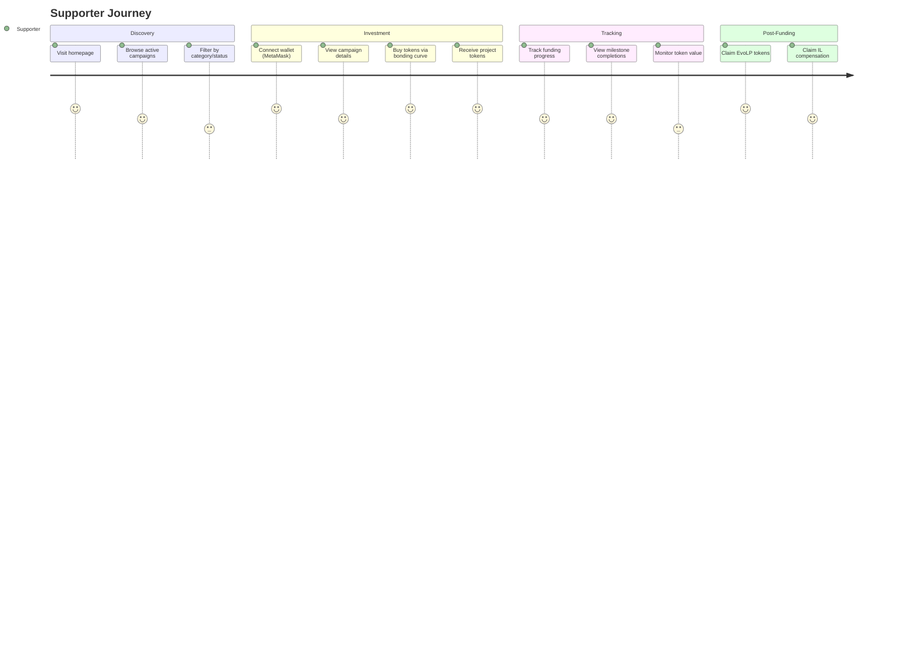
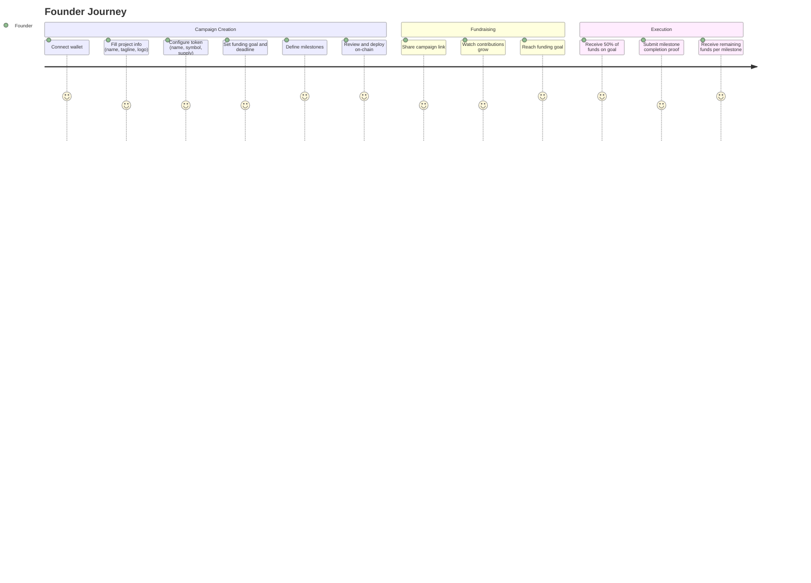
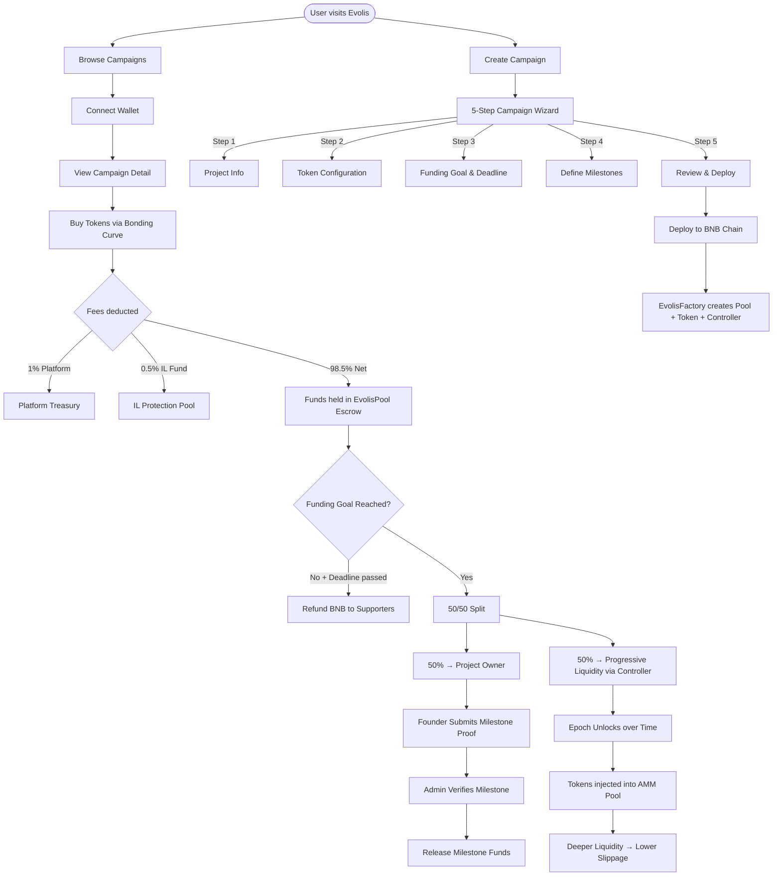

# Evolis — User Journey

## Overview

Evolis serves two primary user types: **Supporters** (backers who fund campaigns) and **Founders** (startup creators who raise capital). Both flows converge through the platform's milestone-gated escrow system.

---

## Complete User Journey

---

## Detailed Flow Diagram

---

## Page-by-Page User Actions

### Home / Explore (`/`)
- Browse campaign cards with name, progress bar, status badge
- Filter campaigns (by category, status)
- Click through to campaign details
- CTA to create your own campaign

### Create Campaign (`/create`)
1. **Project Info** — Name, tagline, logo URL, website/social links, category
2. **Token Configuration** — Token name, symbol, total supply, allocation split (public/team/treasury)
3. **Funding Goal** — Target amount (BNB), deadline (days), unlock/epoch duration
4. **Milestones** — Add milestone descriptions and unlock amounts
5. **Review & Deploy** — Summary of all inputs → deploy transaction via connected wallet

### Campaign Detail (`/campaign/[id]`)
- **Supporters:** View funding progress, buy tokens, see milestone status, activity feed
- **Founders:** Access founder action strip to submit milestone completions
- **Admins:** Navigate to admin panel for milestone verification

### Dashboard (`/dashboard`)
- "My Investments" — campaigns backed, tokens held
- "My Campaigns" — campaigns created, funding status, milestone actions

### Admin Panel (`/admin`)
- Milestone verification interface
- Fund release controls
- Access-gated by admin wallet address
